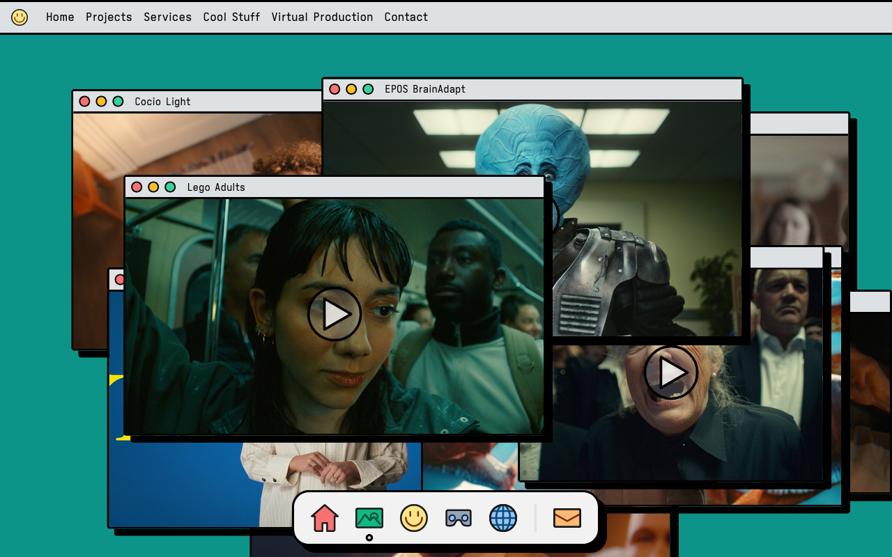
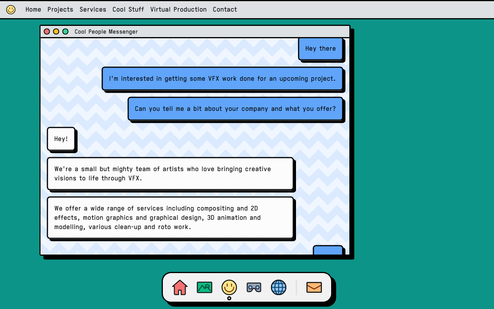

# Onki VFX

A fun and colorful website made for a creative VFX company.

## Motivation

This project originated from a collaboration with director of a VFX company who wanted to establish 
a distinct online presence. The brief called for a vibrant and playful style that would reflect the 
creative nature of the company and its position in the VFX industry. Given that the company primarily 
relies on word-of-mouth referrals, I had the creative freedom to focus on creating a bold visual identity, 
without having to be held back by conventional functionality. This allowed me to create a digital experience 
that embodies the company’s innovative and creative spirit, 
resulting in a website that stands out among the crowd and is memorable.

## Inspiration & style

The style is heavily inspired by the [Neo Brutalism](https://dribbble.com/tags/neo-brutalism) aesthetic, which informs the bright flat colors,
 thick outlines and black shadows. Its a bold art style that catches the eye, and this is combined
 with an interface inspired by the familiar interactions of the everyday OS, specifically draggable
 windows, which makes for a unique experience on the web, yet intuitive since it mimics interfaces people
 are already familiar with. The bright colors and the windows scattered over the page, makes for a bold
 and a little chaotic experience, but a wholly unique and creative identity, perfect for the creative energy of Onki VFX.

## Implementation

The website was developed using [Nuxt.js](https://nuxt.com/), a powerful Vue-based framework that enabled the creation of 
sophisticated visual effects while maintaining clean, semantic HTML structure and optimal performance. 
To achieve fluid, professional-grade animations—particularly for the interactive draggable windows—I 
implemented [GSAP (GreenSock Animation Platform)](https://gsap.com/), an industry-standard animation library known for its 
precision and browser compatibility.

Given the project's scope and the client's minimal content update requirements, I opted for a streamlined 
approach by hardcoding the content directly into the source code, eliminating the overhead of a CMS. 
This decision resulted in faster load times and a more maintainable codebase, while still allowing for 
future content updates through version control.

## Conclusion

The final result is a website that successfully balances experimental design with practical functionality. 
By combining neo-brutalist aesthetics, playful interactions, and modern web technologies, we created a digital 
presence that authentically represents the creative spirit of the VFX studio. The site not only serves as a 
memorable touchpoint for potential clients but also demonstrates how pushing design boundaries can create 
unique and engaging web experiences without compromising on performance or usability.

This project exemplifies how creative freedom, when paired with thoughtful technical implementation, can result 
in a website that stands out in an industry where visual impact matters most.

[Visit the site](https://vfx.onki.tv)
